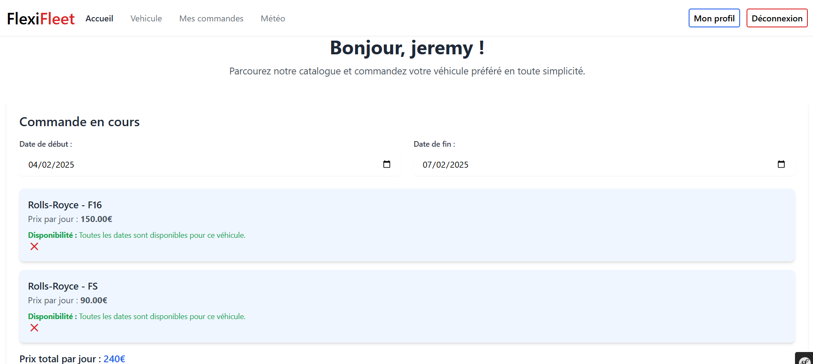
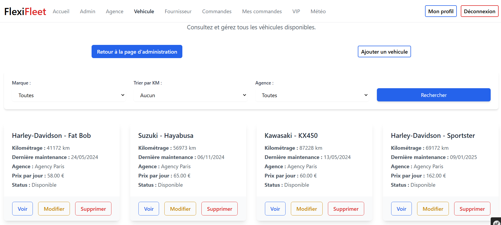

## Aperçu

**FlexiFleet** est une application web développée avec Symfony, conçue pour les agences de location de véhicules. Elle permet une gestion fluide des flottes automobiles, l'administration des agences et des commandes, ainsi que la réservation en ligne pour les clients, y compris des abonnés VIP.

Grâce à une interface intuitive et un contrôle basé sur les rôles, FlexiFleet offre aux entreprises un outil performant pour optimiser la gestion des véhicules et améliorer l'expérience utilisateur.

## Fonctionnalités

- **Gestion des Véhicules** : Ajout, modification et suivi des véhicules, y compris leur disponibilité et kilométrage.
- **Système de Réservation** : Permet aux clients de réserver des véhicules en fonction de la disponibilité.
- **Administration des Agences** : Gestion des agences, des responsables et des employés.
- **Dashboard Interactif** : Vue d’ensemble des statistiques et des activités en temps réel.
- **Contrôle des Rôles** : Administrateurs, chefs d’agence, fournisseurs, gestionnaires de commandes et locataires.
- **Abonnement VIP** : Offre des avantages exclusifs pour des clients privilégiés.

## Technologies Utilisées

- **Symfony** : Framework PHP utilisé pour l’architecture backend.
- **Doctrine** : ORM pour la gestion des bases de données.
- **Docker** : Conteneurisation pour simplifier le déploiement.
- **TailwindCSS** : Styling moderne pour une interface ergonomique.

## Défis Techniques

- Implémentation d’un système avancé de gestion des rôles et permissions.
- Synchronisation en temps réel des disponibilités des véhicules.
- Optimisation de l'expérience utilisateur pour la réservation en ligne.

## Liens

- [Dépôt GitHub](https://github.com/Misokka/flexifleet.git)
