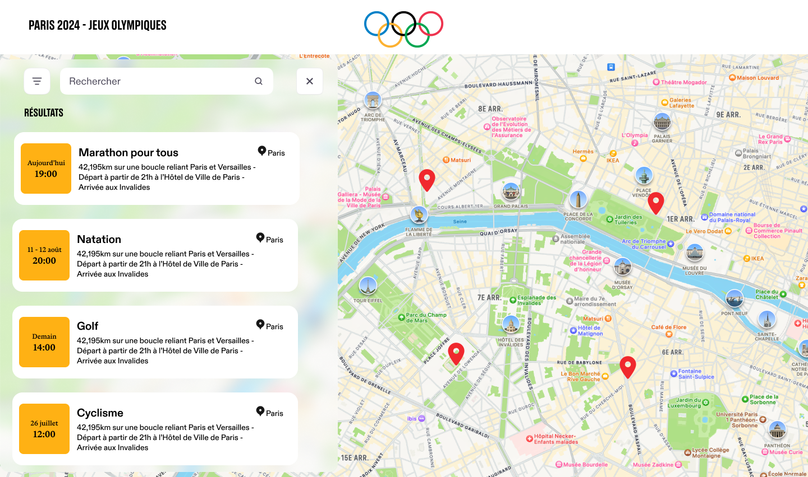
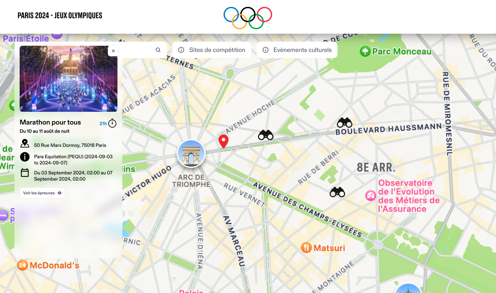

## Aperçu

JoMap est une application web interactive conçue pour les Jeux Olympiques de 2024, permettant aux utilisateurs de découvrir les meilleurs endroits pour profiter des événements en direct.

Développée avec JavaScript et Mapbox, la plateforme offre une expérience fluide pour localiser les lieux des événements, filtrer par sport ou date, et accéder à des informations détaillées sur chaque site.

## Fonctionnalités

- **Carte interactive** : Visualisez les lieux des événements grâce à des marqueurs interactifs utilisant Mapbox.

- **Meilleurs points de vue** : Recommandations pour des emplacements privilégiés, comme des ponts ou des points élevés.
- **Informations détaillées sur les lieux** : Accédez à des détails pratiques, des photos et des heures d'affluence pour chaque site.

## Technologies Utilisées

- **JavaScript** : Logique principale pour les fonctionnalités interactives.
- **HTML & CSS (TailwindCSS)** : Structure et design du frontend.
- **Mapbox** : Intégration pour les cartes et les marqueurs de localisation.

## Liens

- [Dépôt GitHub](https://github.com/Misokka/jomap.git)
